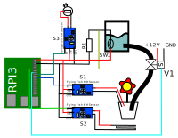
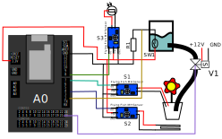
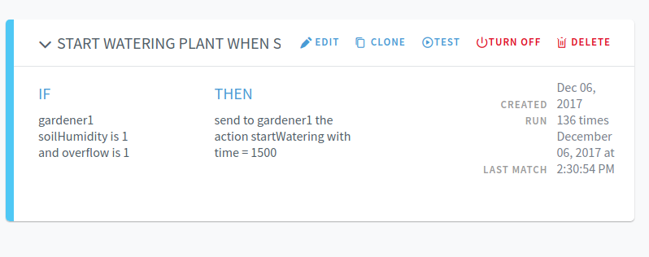

# How to run Gardener device

## Elements and wiring diagram


### RPI3



### Artik053



* RPI3 - Raspberry Pi version 3
* A0 - Artik053 Development board
* S1 - Soil humidity sensor
* S2 - Raindrop sensor
* S3 - Fotoresistor with MH Sensor amp/comparator
* R1 - 13kOhm
* SW1 - Water level reed switch
* V1 - Selenoid water valve

## RPI3 Connection

* S1 - Connect D0 (digital pin) to RPI3 GPIO 25 (22 header pin)
* S2 - Connect D0 (digital pin) to RPI3 GPIO 17 (11 header pin)
* S3 - Connect D0 (digital pin) to RPI3 GPIO 24 (18 header pin)
* V1 - Connect to RPI3 GPIO 22 (15 header pin)
* SW1 - Connect to RPI GPIO 18 (12 header pin)

## Artik053 Connection

* S1 - Connect D0 (digital pin) to Artik053 GPIO 48 (7 pin on CON708 header)
* S2 - Connect D0 (digital pin) to Artik053 GPIO 47 (4 pin on CON709 header)
* S3 - Connect D0 (digital pin) to Artik053 GPIO 50 (8 pin on CON709 header)
* V1 - Connect to Artik053 GPIO 57 (23 pin on CON703 header)
* SW1 - Connect to Artik053 GPIO 46 (2 pin on CON709 header)

Note: All of the MH Sensors need to be calibrated to ouput high/low state in needed values. To
calibrate use a multimeter, set to low voltage values and testout sensors, tuning their output
by turning the potentiometer on their boards.

## How to run

Login to Artik Cloud Developer site and create new device type using the supplied `manifest.json`.
Next login to Artik Cloud and create a new device with the type you have just created. Copy
device id and device token, and save those values to use later.

Copy `configuration.json.sample` to `configuration.json` file and fill device_id and device_token
with the values gathered from Artik Cloud. Make sure that the device pin configurations in the json
file are correct.

Connect RPI3/Artik053 with the supplied diagram, and issue command:

```
iotjs ./run.js
```

This will execute the sample application and start posting data about the conditions of the plant
environment. This data can be viewed in Data Logs or Charts tabs in Artik Cloud.

## Artik Cloud example rule

Go to Rules tab on Artik Cloud and click New Rule. In the condition put `soilHumidity` from your
device and set the value equal to `1`. This means high pin state, because MH Sensor reverses signal
which means high state is when the soil is dry, and low state when is moist.

The action for watering is `startWatering`. It takes a value of time, in miliseconds, for how long
the valve should be opened. Keep the value lower than 2s, which is the interval the script runs, to
avoid any problems or extend interval time.

Note that Artik Cloud has a limit for request number per day on REST api. The interval should be
increased, as 2 seconds is used only for demo purposes, but will deplete the request limit quickly.
A value of 3600000 should optimal (1 hour interval) for watering a real plant.

The created rule should look like something like the following:


